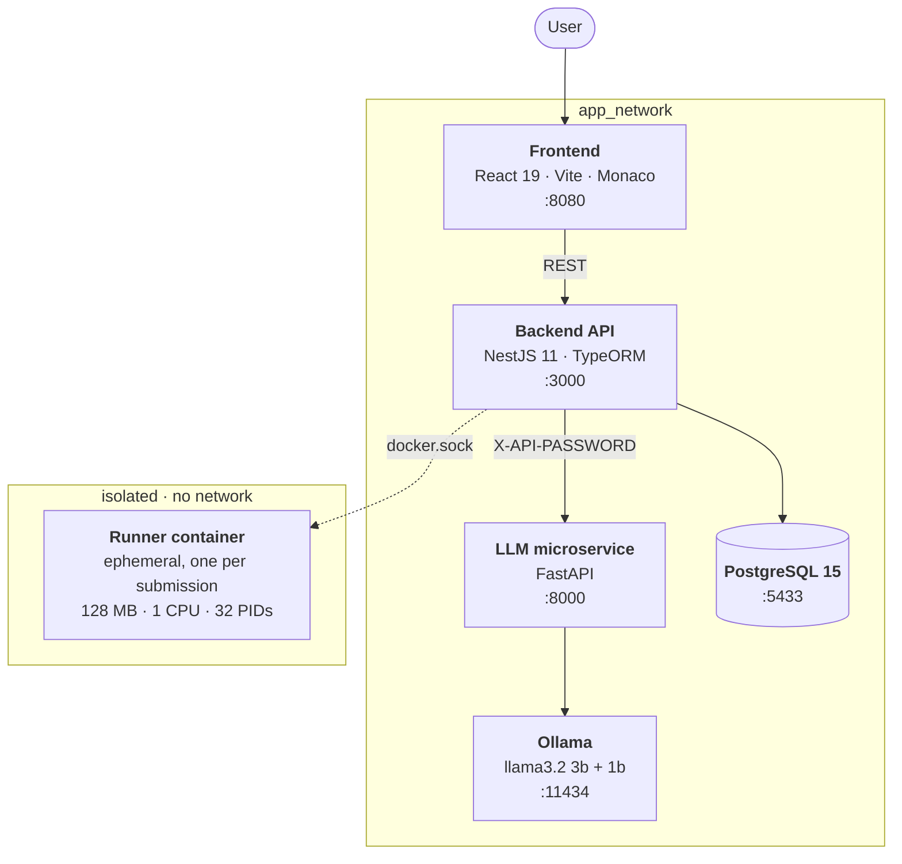

# Online Judge

A self-hosted competitive-programming platform that compiles, runs and judges untrusted user code in 14 languages — each submission executed inside a disposable, network-isolated container.

[](https://nestjs.com/)
[](https://react.dev/)
[](https://www.typescriptlang.org/)
[](https://fastapi.tiangolo.com/)
[](https://www.postgresql.org/)
[](https://docs.docker.com/compose/)
[](LICENSE.md)

<!-- TODO: add a screenshot or GIF of the problem page with the Monaco editor here.
     It is the single highest-impact addition to this README. -->

---

## Table of contents

- [About](#about)
- [Features](#features)
- [Architecture](#architecture)
- [Execution sandbox](#execution-sandbox)
- [Supported languages](#supported-languages)
- [Verdicts](#verdicts)
- [AI assistant](#ai-assistant)
- [Getting started](#getting-started)
- [Environment variables](#environment-variables)
- [API](#api)
- [Testing](#testing)
- [Project structure](#project-structure)
- [Known trade-offs](#known-trade-offs)
- [Roadmap](#roadmap)
- [License](#license)

---

## About

An online judge is deceptively hard: the core feature is *running arbitrary code written by strangers on your own machine*. Everything else — problems, submissions, leaderboards — is ordinary CRUD around that one dangerous operation.

This project was built to tackle that problem directly, and to practise backend architecture on something with real constraints: untrusted input, hard timeouts, resource limits, and a blast radius that has to stay contained.

It is a personal project, developed solo.

## Features

- **Multi-language judging** — 14 languages, compiled and interpreted, each in its own container image.
- **Isolated execution** — one throwaway container per submission, with capped memory, CPU, process count and no network access.
- **Eight distinct verdicts** — including `presentation error`, separating *wrong answer* from *right answer, wrong whitespace*.
- **Per-test-case evaluation** — stops at the first failure and reports peak memory and worst-case runtime across cases.
- **Playground mode** — run code against custom input without submitting it against a problem.
- **AI tutor** — a chat assistant that gives hints and finds bugs but deliberately refuses to hand over solutions.
- **Complexity analysis** — a second, separately tuned model that returns the Big-O of a snippet.
- **Problem authoring** — problems, categories and test cases manageable through the API and UI.
- **Authentication** — JWT access and refresh tokens, bcrypt hashing, email-based password reset with attempt limits.
- **Rate limiting** — global throttling guard on every route.
- **Submission streaks** — per-user activity tracking.
- **In-browser editor** — Monaco (the editor behind VS Code) with language switching.

## Architecture

Five containers orchestrated by Docker Compose. The backend is the only service that talks to the Docker daemon, and the judged code itself runs in short-lived containers with no route back to the application network.



The backend follows a **ports and adapters** layout: every module exposes its dependencies as interfaces (`*Port` symbols) and receives concrete implementations through Nest's DI container. The judge itself sits behind `CodeRunnerProviderPort`, so the Docker-based runner is an interchangeable adapter rather than a hardcoded dependency.

Business logic lives in single-responsibility **use cases** (`create.use-case.ts`, `update-streak.use-case.ts`, …), keeping controllers thin and the rules unit-testable without a database.

## Execution sandbox

Every submission gets a fresh container that is destroyed afterwards. The hardening applied to it:

| Control | Value | Prevents |
|---|---|---|
| `Memory` | 128 MB | Memory exhaustion of the host |
| `NanoCpus` | 1 core | CPU starvation of other submissions |
| `PidsLimit` | 32 | Fork bombs |
| `NetworkMode` | `none` | Exfiltration and outbound abuse |
| `AutoRemove` | enabled | Container leakage across runs |
| Run timeout | 2 s | Infinite loops |
| Compile timeout | 15 s | Pathological compile-time expansion |
| Output cap | 10 000 chars | Log flooding from runaway output |

Two details worth calling out:

**Source code never touches a shell.** It is packed into a tar stream and injected with the Docker archive API, so there is no string interpolation between user input and a command line — the usual injection surface simply does not exist.

**Compilation and execution are measured separately.** A compile failure returns `compilation error` without ever running anything, and peak memory is sampled from the container stats stream during execution rather than estimated afterwards.

## Supported languages

| Language | Image | Compiled |
|---|---|:--:|
| C | `gcc:13` | ✓ |
| C++ | `gcc:13` | ✓ |
| C# | `mcr.microsoft.com/dotnet/sdk:8.0` | ✓ |
| Go | `golang:1.22-alpine` | ✓ |
| Java | `eclipse-temurin:21` | ✓ |
| Kotlin | `zenika/kotlin` | ✓ |
| Rust | `rust:1.76` | ✓ |
| Clojure | `babashka/babashka` | — |
| JavaScript | `node:24-alpine` | — |
| Lua | `nickblah/lua` | — |
| PHP | `php:8.3-cli` | — |
| Python | `python:3.9-alpine` | — |
| Ruby | `ruby:3.3-alpine` | — |
| TypeScript | `node:24-alpine` | — |

All language images are pulled once when the API starts and cached from then on, so the first submission in a language pays no download cost. Adding a language means one entry in `backend/src/shared/provider/code-runner/infra/languages/languages.ts` — no other code changes.

## Verdicts

| Verdict | Meaning |
|---|---|
| `accepted` | Output matched on every test case |
| `wrong answer` | Output differed in content |
| `presentation error` | Output correct, but whitespace or line breaks differ |
| `compilation error` | Source failed to compile |
| `runtime error` | Non-zero exit code during execution |
| `time limit exceeded` | Ran past the language time limit |
| `submission error` | Judge failed to produce a result |
| `pending` | Queued, not yet judged |

`presentation error` is what separates a real judge from a string comparison: output is normalised (line endings, collapsed whitespace, trailing newlines) and compared again before deciding the submission is actually wrong.

## AI assistant

A dedicated FastAPI microservice fronts two Ollama models built from custom `Modelfile`s, each tuned for a different job:

| Model | Base | Temperature | Purpose |
|---|---|:--:|---|
| `online_judge_chat_model` | `llama3.2:3b` | 0.8 | Tutoring: hints, concept explanations, debugging guidance |
| `online_judge_evaluation_model` | `llama3.2:1b` | 0 | Time-complexity analysis, Big-O only |

The tutor is explicitly constrained to **not** hand over working solutions — it explains, hints and asks guiding questions instead, and replies in whatever language the user wrote in. The analyser runs deterministically at temperature 0 with a strict output contract, so its answer can be parsed directly.

The microservice is reachable only from inside the Compose network and requires an `X-API-PASSWORD` header, compared in constant time.

## Getting started

### Prerequisites

- [Docker](https://docs.docker.com/get-docker/) and Docker Compose
- Roughly 8 GB of free disk space — the language images and the Ollama models are pulled on demand
- No local Node.js or Python installation required

### Setup

```bash
git clone https://github.com/andregarcia0412/online_judge.git
cd online_judge
```

Create the environment files from the provided templates:

```bash
cp backend/.env.example backend/.env
cp frontend/.env.example frontend/.env
cp llm-microservice/.env.example llm-microservice/.env
```

Fill in the values described in [Environment variables](#environment-variables).

### Run

```bash
docker compose up --build
```

| Service | URL |
|---|---|
| Frontend | http://localhost:8080 |
| API | http://localhost:3000 |
| Swagger UI | http://localhost:3000/docs |
| LLM microservice | http://localhost:8000 |
| Ollama | http://localhost:11434 |

The first run is slow: Ollama builds both custom models from their `Modelfile`s, and the API pulls all 14 language images before accepting submissions. Later starts reuse both. The API is up once `/health` responds.

With `RUN_SEEDS=true` the database is populated with sample problems and test cases on boot.

## Environment variables

### `backend/.env`

Validated at startup with Joi — the application refuses to boot on a missing or malformed value rather than failing later at runtime.

| Variable | Description | Default |
|---|---|---|
| `PORT` | API port | `3000` |
| `NODE_ENV` | `development` or `production` | `development` |
| `ALLOWED_ORIGINS` | Comma-separated CORS origins (required in production) | — |
| `THROTTLE_TTL` | Rate-limit window in ms (min. 10000) | `60000` |
| `THROTTLE_LIMIT` | Requests per window (min. 10) | `100` |
| `DB_HOST` `DB_PORT` `DB_USERNAME` `DB_PASSWORD` `DB_NAME` | PostgreSQL connection | — |
| `JWT_ACCESS_SECRET` | Access-token signing secret | — |
| `JWT_REFRESH_SECRET` | Refresh-token signing secret | — |
| `JWT_ACCESS_EXPIRATION_TIME` | e.g. `15m` | — |
| `JWT_REFRESH_EXPIRATION_TIME` | e.g. `7d` | — |
| `PASSWORD_RESET_SECRET` | Reset-code signing secret | — |
| `MAX_RESET_PASSWORD_TRIES` | Attempts before a reset code is invalidated | `10` |
| `RESEND_API_KEY` | [Resend](https://resend.com) key (required in production) | — |
| `MAIL_FROM` | Sender address for reset emails | — |
| `BCRYPT_SALT` | Salt rounds (4–31) | `10` |
| `LLM_API_URL` | LLM microservice base URL | — |
| `INTERNAL_API_KEY` | Shared secret for the microservice | — |
| `RUN_SEEDS` | Seed sample problems on boot | `true` |

### `frontend/.env`

| Variable | Description |
|---|---|
| `VITE_API_URL` | Base URL of the backend API |

### `llm-microservice/.env`

| Variable | Description |
|---|---|
| `INTERNAL_API_KEY` | Must match the backend value |

## API

Interactive documentation is generated with Swagger and served at **`/docs`** once the backend is running.

<details>
<summary><b>Endpoint overview</b></summary>

**Auth** — `POST /auth/register` · `POST /auth/login` · `POST /auth/refresh` · `POST /auth/forgot-password` · `POST /auth/reset-password`

**Users** — `POST /user` · `GET /user/me` · `PATCH /user/me` · `DELETE /user/me`

**Problems** — `POST /problem` · `GET /problem` · `GET /problem/:id` · `PATCH /problem/:id` · `DELETE /problem/:id`

**Categories** — `GET /category` · `GET /category/:id` · `PATCH /category/:id` · `DELETE /category/:id` · `POST /problem/:id/category` · `GET /problem/:id/category`

**Test cases** — `POST /test-case` · `GET /test-case` · `GET /test-case/:id` · `PATCH /test-case/:id` · `DELETE /test-case/:id` · `GET /problem/:id/test-case`

**Submissions** — `POST /submission` · `POST /submission/playground` · `GET /submission` · `GET /submission/me` · `GET /submission/:id` · `PATCH /submission/:id` · `DELETE /submission/:id`

**AI** — `POST /llm/ask` · `POST /llm/analyze`

**System** — `GET /health` · `GET /info`

</details>

Requests are validated globally with `ValidationPipe` using `whitelist` and `forbidNonWhitelisted`, so unknown properties are rejected outright rather than silently ignored.

## Testing

```bash
cd backend

npm test           # unit tests
npm run test:cov   # unit tests with coverage
npm run test:e2e   # end-to-end tests
```

41 unit test files cover the use cases, the test runner and the code runner, with repositories and the Docker provider mocked so the suite runs without containers.

A separate load harness (`src/modules/submission/test/submission.load.e2e-spec.ts`) fires concurrent submissions at a running instance to verify the judge holds up under parallelism. It is skipped by default — remove the `.skip` and point it at a live API to run it.

## Project structure

```
.
├── backend/              # NestJS API — auth, problems, submissions, judging
│   ├── src/
│   │   ├── modules/      # feature modules (use cases, entities, repositories)
│   │   └── shared/       # code runner, tar packer, cross-cutting providers
│   └── test/             # unit tests mirroring the module tree
├── frontend/             # React 19 + Vite + Tailwind + Monaco
├── llm-microservice/     # FastAPI service fronting Ollama
├── ollama/               # Modelfiles and entrypoint for the custom models
└── docker-compose.yml
```

## Known trade-offs

Stated openly, because they are deliberate choices rather than oversights:

- **The backend mounts the Docker socket.** It needs the daemon to spawn runner containers. Submitted code never touches the socket — it runs in a separate, network-less container — but a compromise of the backend itself would mean host-level access. Stronger isolation would mean rootless Docker, a dedicated runner service, or a microVM runtime such as gVisor or Firecracker.
- **`synchronize: true` on TypeORM.** Convenient in development, unsuitable for production; migrations are the intended replacement.
- **Judging is synchronous.** Submissions are executed inline rather than through a queue, which bounds throughput to the API process.

## Roadmap

- [ ] Job queue for submissions, decoupling judging from the request cycle
- [ ] Database migrations replacing schema synchronisation
- [ ] Contests with live scoreboards
- [ ] Per-problem memory and time limits
- [ ] CI pipeline running the test suite on every push

## License

Distributed under the MIT License. See [`LICENSE.md`](LICENSE.md) for details.

## Author

**André Paiva Garcia**

[](https://github.com/andregarcia0412)
[](https://www.linkedin.com/in/andre-garcia0412/)
